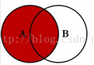
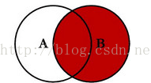

# MySQL-learning-notes
<!-- TOC -->

- [MySQL-learning-notes](#mysql-learning-notes)
  - [1. MySQL数据库基本操作](#1-mysql数据库基本操作)
    - [1.1. MySQL查看数据库(SHOW DATABASES语句)](#11-mysql查看数据库show-databases语句)
    - [1.2. MySQL创建数据库(CREATE DATABASE语句)](#12-mysql创建数据库create-database语句)
    - [1.3. MySQL修改数据库(ALTER DATABASE语句)](#13-mysql修改数据库alter-database语句)
    - [1.4. MySQL删除数据库(DROP DATABASE语句)](#14-mysql删除数据库drop-database语句)
    - [1.5. MySQL选择数据库(USE语句)](#15-mysql选择数据库use语句)
    - [1.6. MySQL注释](#16-mysql注释)
    - [1.7. MySQL中SQL语句大小写规则](#17-mysql中sql语句大小写规则)
    - [1.8. 数据库设计基本步骤](#18-数据库设计基本步骤)
  - [2. MySQL数据类型和存储引擎](#2-mysql数据类型和存储引擎)
    - [2.1. 整数类型](#21-整数类型)
    - [2.2. 浮点数类型](#22-浮点数类型)
    - [2.3. 日期时间类型](#23-日期时间类型)
    - [2.4. 字符串类型](#24-字符串类型)
      - [2.4.1. ENUM类型](#241-enum类型)
      - [2.4.2. SET类型](#242-set类型)
    - [2.5. 二进制类型](#25-二进制类型)
      - [2.5.1. BIT类型](#251-bit类型)
      - [2.5.2. BINARY 和 VARBINARY 类型](#252-binary-和-varbinary-类型)
    - [2.6. MySQL数据类型选择](#26-mysql数据类型选择)
      - [2.6.1. 数值类型](#261-数值类型)
      - [2.6.2. 字符串类型](#262-字符串类型)
    - [2.7. MySQL转义字符](#27-mysql转义字符)
    - [MySQL系统变量](#mysql系统变量)
      - [查看系统变量](#查看系统变量)
      - [设置系统变量](#设置系统变量)
    - [MySQL存储引擎](#mysql存储引擎)
  - [MySQL数据表操作](#mysql数据表操作)
    - [创建数据表(CREATE TABLE)](#创建数据表create-table)
    - [修改数据表(ALTER TABLE)](#修改数据表alter-table)
    - [删除数据表(DROP TABLES)](#删除数据表drop-tables)
    - [查看表结构(DESCRIBE)](#查看表结构describe)
  - [MySQL约束和运算符](#mysql约束和运算符)
    - [MySQL约束](#mysql约束)
    - [主键约束(PRIMARY KEY)](#主键约束primary-key)
      - [创建表时设置主键约束](#创建表时设置主键约束)
      - [表创建后设置主键约束](#表创建后设置主键约束)
      - [删除主键约束](#删除主键约束)
    - [主键自增长 (PRIMARY KEY AUTO\_INCREMENT)](#主键自增长-primary-key-auto_increment)
    - [外键约束(FOREIGN KEY)](#外键约束foreign-key)
      - [在创建表时设置外键约束](#在创建表时设置外键约束)
      - [表创建后设置外键约束](#表创建后设置外键约束)
    - [唯一约束(UNIQUE KEY)](#唯一约束unique-key)
    - [检查(CHECK)](#检查check)
    - [默认值(DEFAULT)](#默认值default)
    - [非空(NOT NULL)](#非空not-null)
    - [运算符](#运算符)
      - [算术运算符](#算术运算符)
      - [逻辑运算符](#逻辑运算符)
      - [比较运算符](#比较运算符)
      - [位运算符](#位运算符)
  - [MySQL操作数据表中的数据](#mysql操作数据表中的数据)
    - [添加数据(INSERT INTO)](#添加数据insert-into)
    - [修改数据(UPDATE)](#修改数据update)
    - [删除数据(DELETE)](#删除数据delete)
    - [查询数据(SELECT)](#查询数据select)
      - [DISTINCT去重](#distinct去重)
      - [AS指定别名](#as指定别名)
      - [WHERE条件查询](#where条件查询)
        - [模糊查询](#模糊查询)
        - [范围查询](#范围查询)
        - [空值查询](#空值查询)
      - [GROUP BY分组查询](#group-by分组查询)
      - [ORDER BY排序](#order-by排序)
      - [LIMIT限制查询结果条数](#limit限制查询结果条数)
    - [常函数](#常函数)
  - [多表查询](#多表查询)
    - [多表关系](#多表关系)
    - [交叉连接(CROSS JOIN)](#交叉连接cross-join)
    - [内连接(INNER JOIN)](#内连接inner-join)
    - [外连接](#外连接)
      - [左连接](#左连接)
      - [右连接](#右连接)
      - [外连接查询的其它使用场景](#外连接查询的其它使用场景)
        - [实现查询A-B](#实现查询a-b)
        - [实现查询B-A](#实现查询b-a)
    - [自连接](#自连接)
    - [联合查询(UNION)](#联合查询union)
    - [子查询](#子查询)
      - [标量子查询](#标量子查询)
      - [行列子查询](#行列子查询)
      - [表子查询](#表子查询)
  - [MySQL视图、索引](#mysql视图索引)

<!-- /TOC -->

## 1. MySQL数据库基本操作

对数据库进行查询和修改操作的语言叫做 SQL（Structured Query Language，结构化查询语言）。SQL语句包含一下几个部分：

- 数据定义语言**DDL**

> 用来创建或删除数据库以及表等对象  
> `CREAATE`创建数据库或表对象；  
> `DROP`删除数据库或表对象；
> `ALTER`修改数据库和表对象；

- 数据操作语言**DML**

> 用来改变数据表里的记录  
> `SELECT`查询表里的记录  
> `INSERT`向表里插入记录  
> `UPGRADE`更新表里的记录  
> `DELETE`删除表里的记录

- 数据查询语言**DQL**

>用来查询表中的记录，主要包含 SELECT 命令，来查询表中的数据。

- 数据控制语言**DCL**

>用来确认或者取消对数据库中的数据进行变更，设定用户的权限
>
>- `GRANT`：赋予用户操作权限
>- `REVOKE`：取消用户的操作权限
>- `COMMIT`：确认对数据库中的数据进行的变更
>- `ROLLBACK`：取消对数据库中的数据进行的变更

SQL语句书写规则：

- 每句以`;`结尾
- 不区分大小写，但通常关键字为大写，数据库或表名为小写
- 常数的书写方式固定：数字直接书写，不需要改变；字符串`''`单引号括起来；日期书写方式有`'2022-01-22'`、`'22/01/22'`
- 不同单次用半角空格或换行来分隔

### 1.1. MySQL查看数据库(SHOW DATABASES语句)

语句为`SHOW DATABASES LIKE '数据库名'`  
语法说明如下：

- LIKE 从句是可选项，用于匹配指定的数据库名称。
- LIKE 从句可以部分匹配`%数据库名部分字段%'`，也可以完全匹配。数据库名由单引号' '包围。

```SQL
SHOW DATABASES;
结果：
Database           |
+--------------------+
| information_schema |
| mysql              |
| performance_schema |
| sakila             |
| sys                |
| world              |
+--------------------+
```

在上面的列表中有 6 个数据库，它们都是安装 MySQL 时系统自动创建的，其各自功能如下：

>- information_schema：主要存储了系统中的一些数据库对象信息，比如用户表信息、列信息、权限信息、字符集信息和分区信息等。
>- mysql：MySQL 的核心数据库，类似于 SQL Server 中的 master 表，主要负责存储数据库用户、用户访问权限等 MySQL 自己需要使用的控制和管理信息。常用的比如在 mysql 数据库的 user 表中修改 root 用户密码。
>- performance_schema：主要用于收集数据库服务器性能参数。
>- sakila：MySQL 提供的样例数据库，该数据库共有 16 张表，这些数据表都是比较常见的，在设计数据库时，可以参照这些样例数据表来快速完成所需的数据表。
>- sys：MySQL 5.7 安装完成后会多一个 sys 数据库。sys 数据库主要提供了一些视图，数据都来自于 performation_schema，主要是让开发者和使用者更方便地查看性能问题。
>- world：world 数据库是 MySQL 自动创建的数据库，该数据库中只包括 3 张数据表，分别保存城市，国家和国家使用的语言等内容。

### 1.2. MySQL创建数据库(CREATE DATABASE语句)

语句:

```SQL
CREATE DATABASE [IF NOT EXISTS] 数据库名
 [[DEFAULT] CHARACTER SET 字符集名 ] 
 [[DEFAULT] COLLATE 校对规则名];
```

`[]`里的内容为可选选项。语句说明：  

>- 数据库名：创建数据库的名称。MySQL 的数据存储区将以目录方式表示 MySQL 数据库，因此数据库名称必须符合操作系统的文件夹命名规则，不能以数字开头，尽量要有实际意义。注意在 MySQL 中不区分大小写。
>- IF NOT EXISTS：在创建数据库之前进行判断，只有该数据库目前尚不存在时才能执行操作。此选项可以用来避免数据库已经存在而重复创建的错误。
>- [DEFAULT] CHARACTER SET：指定数据库的字符集。指定字符集的目的是为了避免在数据库中存储的数据出现乱码的情况。如果在创建数据库时不指定字符集，那么就使用系统的默认字符集。
>- [DEFAULT] COLLATE：指定字符集的默认校对规则

### 1.3. MySQL修改数据库(ALTER DATABASE语句)

在 MySQL 数据库中只能对数据库使用的**字符集**和**校对规则**进行修改，数据库的这些特性都储存在 db.opt 文件中。
语句：

```SQL
ALTER DATABASE 数据库名 
CHARACTER SET 字符集名
COLLATE 校对规则名;
```

### 1.4. MySQL删除数据库(DROP DATABASE语句)

当数据库不再使用时应该将其删除，以确保数据库存储空间中存放的是有效数据。删除数据库是将已经存在的数据库从磁盘空间上清除，清除之后，数据库中的所有数据也将一同被删除。语句格式:

```sql
DROP DATABASE IF EXISTS 数据库名；
```

IF EXISTS：用于防止当数据库不存在时发生错误。

### 1.5. MySQL选择数据库(USE语句)

在 MySQL 中就有很多系统自带的数据库，那么在操作数据库之前就必须要确定是哪一个数据库。

```sql
USE 数据库名;
```

### 1.6. MySQL注释

- 单行注释

`#注释内容`

- 多行注释

```sql
/*
注释内容
*/
```

### 1.7. MySQL中SQL语句大小写规则

- **SQL 关键字和函数名**  
  不区分大小写

- **数据库名、表名和视图名**  
  区不区分大小写视操作系统类型决定：windows和MAC OS不区分，Linux区分。

- **存储程序的名字**  
  存储函数、存储过程和事件的名字都不区分大小写。触发器的名字要区分大小写，这一点与标准 SQL 的行为有所不同。

- **列名和索引名**  
  列名和索引名都不区分大小写。
- **别名的名字**  
  默认情况下，表的别名要区分大小写。

下表总结了 SQL 元素在 Windows 和 Linux 系统是否区分大小写。

||Windows|Linux|
|---|---|---|
|数据库名|否|是|
|表名|否|是|
|表别名|否|是|
|列名|否|否|
|列别名|否|否|
|变量名|否|是|

在 Linux 服务器下创建数据库和表时，应该认真考虑大小写的问题，比如它们以后是否会迁移到 Windows 服务器上。

### 1.8. 数据库设计基本步骤

按照规范设计的方法，考虑数据库及其应用系统开发全过程，将数据库设计分为以下 6 个阶段：

- 需求分析  
  需求分析是数据库设计的第一步，是最困难、最耗费时间的一步，也是整个设计过程的基础。本阶段的主要任务是对现实世界中要处理的对象（公司、部门及企业，也可以理解成客户）进行详细调查，然后通过分析，逐步明确客户/用户对系统的需求，包括数据需求和业务处理需求。需求分析是否做的充分和准确，直接决定了在其上构建数据库大厦的速度与质量。需求分析做的不好，会导致整个数据库设计返工重做。
- 概要设计  
  概要设计是数据库设计的关键，通过综合、归纳与抽象用户需求，形成一个具体 DBMS 的概念模型，也就是绘制数据库的 E-R 图。E-R 图主要用于在项目团队内部，设计人员和客户之间进行沟通，确认需求信息的正确性和完整性。
- 逻辑结构设计  
  将 E-R 图转换为多张表，进行逻辑设计，确认各表的主外键，并应用数据库设计的三大范式进行审核，对其优化。在这阶段，E-R 图非常重要。大家要学会根据各个实体定义的属性来画出总体的 E-R 图。
- 物理设计阶段  
- 经项目组开会讨论确定 E-R 图后，根据项目的技术实现，团队开发能力及项目的成本预算，选择具体的数据库（如 MySQL 或 Oracle 等）进行物理实现。
- 数据库实施阶段  
  运用 DBMS 提供的数据语言（例如 SQL）、工具及宿主语言（例如 Java），根据逻辑设计和物理设计的结果建立数据库，编制与调试应用程序，组织数据入库，并进行试运行。
- 数据库运行和维护阶段
  数据库应用系统经过试运行后即可投入正式运行。在运行过程中必须不断地对其进行评价、调整与修改。

## 2. MySQL数据类型和存储引擎

MySQL数据类型分为5类：整数类型、浮点数类型、日期时间类型、字符串类型和二进制类型。

### 2.1. 整数类型

类型名称|说明|存储需求
---|---|---
TINYINT| -128〜127 |1个字节
SMALLINT| -32768〜32767| 2个字节
MEDIUMINT |-8388608〜8388607| 3个字节
INT (INTEGER) |-2147483648〜2147483647|4个字节
BIGINT |-9223372036854775808〜9223372036854775807 |8个字节

### 2.2. 浮点数类型

类型名称|说明|存储需求
---|---|---
FLOAT|单精度浮点数|4个字节
DOUBLE|双精度浮点数|8个字节
DECIMAL(M,D)|压缩的“严格”定点数|M+2个字节

- DECIMAL(M, D)，其中M称为精度，表示总共的位数；D称为标度，表示小数的位数。
- 浮点数类型存在四舍五入忽略误差的问题，定点数不存在。

### 2.3. 日期时间类型

MySQL 中有多处表示日期的数据类型：**YEAR、TIME、DATE、DTAETIME、TIMESTAMP**。
类型名称|格式|日期范围|存储需求
---|---|---|---|
YEAR|YYYY|1901 ~ 2155| 1 个字节
TIME |HH:MM:SS| -838:59:59 ~ 838:59:59 |3 个字节
DATE |YYYY-MM-DD |1000-01-01 ~ 9999-12-3 |3 个字节
DATETIME |YYYY-MM-DD HH:MM:SS| 1000-01-01 00:00:00 ~ 9999-12-31 23:59:59 |8 个字节
TIMESTAMP| YYYY-MM-DD HH:MM:SS |1980-01-01 00:00:01 UTC ~ 2040-01-19 03:14:07 UTC| 4 个字节

- 如果同时需要记录日期和时间，则可以使用 TIMESTAMP 或者 DATETIME 类型。由于TIMESTAMP 列的取值范围小于 DATETIME 的取值范围，因此存储较大的日期最好使用 DATETIME。
- TIMESTAMP 也有一个 DATETIME 不具备的属性。默认情况下，当插入一条记录但并没有指定 TIMESTAMP 这个列值时，MySQL 会把 TIMESTAMP 列设为当前的时间。因此当需要插入记录和当前时间时，使用 TIMESTAMP 是方便的，另外 TIMESTAMP 在空间上比 DATETIME 更有效。

### 2.4. 字符串类型

MySQL 中的字符串类型有 **CHAR、VARCHAR、TINYTEXT、TEXT、MEDIUMTEXT、LONGTEXT、ENUM、SET**等。

类型名称|说明|存储需求
---|---|---
CHAR(M)| 固定长度非二进制字符串| M 字节，1<=M<=255
VARCHAR(M) |变长非二进制字符串 |L+1字节，在此，L< = M和 1<=M<=255
TINYTEXT| 非常小的非二进制字符串 |L+1字节，在此，L<2^8
TEXT |小的非二进制字符串| L+2字节，在此，L<2^16
MEDIUMTEXT| 中等大小的非二进制字符串| L+3字节，在此，L<2^24
LONGTEXT| 大的非二进制字符串| L+4字节，在此，L<2^32
ENUM| 枚举类型，只能有一个枚举字符串值| 1或2个字节，取决于枚举值的数目 (最大值为65535)
SET |一个设置，字符串对象可以有零个或 多个SET成员| 1、2、3、4或8个字节，取决于集合 成员的数量（最多64个成员）

说明：

- CHAR(M) 为固定长度字符串，在定义时指定字符串列长。当保存时，在右侧填充空格以达到指定的长度。
- VARCHAR(M) 是长度可变的字符串，最大实际长度由最长的行的大小和使用的字符集确定，而实际占用的空间为字符串的实际长度加 1。VARCHAR 在值保存和检索时尾部的空格仍保留。
- TEXT 列保存非二进制字符串，如文章内容、评论等。当保存或查询 TEXT 列的值时，不删除尾部空格。

#### 2.4.1. ENUM类型

是一个字符串对象，值为表创建时列规定中枚举的一列值。其语法格式如下：

  ```sql
  字段名 ENUM( '值1', '值1', …, '值n' )
  ```

ENUM 类型的字段在取值时，能在指定的枚举列表中获取，而且**一次只能取一个**。  
ENUM 值在内部用整数表示，**每个枚举值均有一个索引值**；列表值所允许的成员值从 1 开始编号，MySQL 存储的就是这个索引编号。

#### 2.4.2. SET类型

是一个字符串的对象，可以有零或多个值，SET 列最多可以有 64 个成员，值为表创建时规定的一列值。指定包括多个 SET 成员的 SET 列值时，各成员之间用逗号,隔开，语法格式如下：

```sql
字段名 SET('值1','值2',...,'值n')
```

- 与 ENUM 类型相同，SET 值在内部用整数表示，列表中每个值都有**一个索引编号**。当创建表时，SET 成员值的尾部空格将自动删除。
- 但与 ENUM 类型不同的是，ENUM 类型的字段只能从定义的列值中选择一个值插入，而 SET 类型的列可从定义的列值中**选择多个字符的联合**。
- 如果插入 SET 字段中的列值有重复，则 MySQL **自动删除重复的值**；插入 SET 字段的值的顺序并不重要，MySQL 会在存入数据库时，**按照定义的顺序显示**；如果插入了不正确的值，默认情况下，MySQL 将忽视这些值，给出警告。

### 2.5. 二进制类型

MySQL 中的**二进制字符串**有 **BIT、BINARY、VARBINARY、TINYBLOB、BLOB、MEDIUMBLOB 和 LONGBLOB**。
类型名称|说明|存储需求
---|---|---
BIT(M)| **位字段类型**| 大约 (M+7)/8 字节
BINARY(M) |固定长度二进制字符串 |M 字节
VARBINARY (M)| 可变长度二进制字符串|M+1 字节
TINYBLOB (M)| 非常小的BLOB| L+1 字节，在此，L<2^8
BLOB (M)| 小 BLOB |L+2 字节，在此，L<2^16
MEDIUMBLOB (M)| 中等大小的BLOB| L+3 字节，在此，L<2^24
LONGBLOB (M)| 非常大的BLOB| L+4 字节，在此，L<2^32

#### 2.5.1. BIT类型

- 位字段类型。
- M 表示每个值的位数，范围为 1～64。如果 M 被省略，默认值为 1。
- 如果为 BIT(M) 列分配的值的长度小于 M 位，在值的左边用 0 填充。例如，为 BIT(6) 列分配一个值 b'101'，其效果与分配 b'000101' 相同。

#### 2.5.2. BINARY 和 VARBINARY 类型

- BINARY 和 VARBINARY 类型类似于 CHAR 和 VARCHAR，不同的是它们包含二进制字节字符串。
- BINARY 类型的长度是固定的，指定长度后，不足最大长度的，将在它们右边填充 “\0” 补齐，以达到指定长度。
- VARBINARY 类型的长度是可变的，指定好长度之后，长度可以在 0 到最大值之间。

### 2.6. MySQL数据类型选择

#### 2.6.1. 数值类型

- 如果要存储的数字是整数，则使用整数类型(在细分存储范围)；如果要存储的数字是小数（带有小数部分），则可以选用 DECIMAL 或浮点类型，但是一般选择 FLOAT 类型（浮点类型的一种）。
- 如果取值为正，则使用UNSIGNED 用来将数字类型无符号化。如：取值范围是 1~99999 之间的整数，则 MEDIUMINT UNSIGNED 类型是最好的选择。

#### 2.6.2. 字符串类型

- CHAR 是固定长度，所以它的处理速度比 VARCHAR 的速度要快，但是它的缺点就是浪费存储空间。所以对存储不大，但在速度上有要求的可以使用 CHAR 类型，反之可以使用 VARCHAR类型来实现。
- 存储引擎对于选择 CHAR 和 VARCHAR 的影响:  
  >对于 MyISAM 存储引擎，最好使用固定长度的数据列代替可变长度的数据列。这样可以使整个表静态化，从而使数据检索更快，用空间换时间。  
  >对于InnoDB存储引擎，最好使用可变长度的数据列，因为 InnoDB 数据表的存储格式不分固定长度和可变长度，因此使用 CHAR 不一定比使用 VARCHAR 更好，但由于 VARCHAR 是按照实际的长度存储，比较节省空间，所以对磁盘 I/O 和数据存储总量比较好。
- ENUM 和 SET  
  >ENUM 只能取单值，它的数据列表是一个枚举集合。它的合法取值列表最多允许有 65 535个成员。因此，在需要从多个值中选取一个时，可以使用 ENUM。比如，性别字段适合定义，为 ENUM 类型，每次只能从‘男’或‘女’中取一个值。  
  >SET 可取多值。它的合法取值列表最多允许有 64 个成员。空字符串也是一个合法的 SET值。在需要取多个值的时候，适合使用 SET 类型，比如，要存储一个人兴趣爱好，最好使用SET类型。
- BLOB和TEXT  
  >BLOB 是二进制字符串，TEXT 是非二进制字符串，两者均可存放大容量的信息。BLOB 主要存储图片、音频信息等，而 TEXT 只能存储纯文本文件。

### 2.7. MySQL转义字符

MySQL 中常见的转义字符如下表所示：
转义字符|说明
---|---
 \  " |双引号（"）
\  '| 单引号（'）
\  \  | 反斜线（\）
\n |换行符
\r |回车符
\t |制表符
\0 |ASCII 0（NUL）
\b| 退格符

### MySQL系统变量

 MySQL 数据库变量分为系统变量和用户自定义变量。**系统变量以 @@ 开头，用户自定义变量以 @ 开头**。  

 服务器维护着**两种系统变量**，**即全局变量（GLOBAL VARIABLES）**和**会话变量（SESSION VARIABLES**）。全局变量影响 MySQL 服务的整体运行方式，会话变量影响具体客户端连接的操作。

每一个客户端成功连接服务器后，都会产生与之对应的会话。会话期间，MySQL 服务实例会在服务器内存中生成与该会话对应的会话变量，这些会话变量的初始值是全局变量值的拷贝。

#### 查看系统变量

使用语句：

```sql
SHOW GLOBAL VARIABLES; 
SHOW SESSION VARIABLES;#SESSION 关键字可以省略。
```

- MySQL 中有一些系统变量仅仅是全局变量，例如 innodb_data_file_path，可以使用以下 3 种方法查看：  

```sql
SHOW GLOBAL VARIABLES LIKE 'innodb_data_file_path';
SHOW SESSION VARIABLES LIKE 'innodb_data_file_path';
SHOW VARIABLES LIKE 'innodb_data_file_path';
```

- MySQL 中有一些系统变量仅仅是会话变量，例如 MySQL 连接 ID 会话变量 pseudo_thread_id，可以使用以下 2 种方法查看。  
  
  ```sql
  SHOW SESSION VARIABLES LIKE 'pseudo_thread_id';  
  SHOW VARIABLES LIKE 'pseudo_thread_id';
  ```

- MySQL 中有一些系统变量既是全局变量，又是会话变量，例如系统变量 character_set_client 既是全局变量，又是会话变量。

 ```sql
  SHOW SESSION VARIABLES LIKE 'character_set_client';  
  SHOW VARIABLES LIKE 'character_set_client';
 ```

此时查看全局变量的方法如下：

```sql
SHOW GLOBAL VARIABLES LIKE 'character_set_client';
```

#### 设置系统变量

可以通过以下方法设置系统变量：

- 修改 MySQL 源代码，然后对 MySQL 源代码重新编译。
- 在 MySQL 配置文件（mysql.ini 或 mysql.cnf）中修改 MySQL 系统变量的值（需要重启 MySQL 服务才会生效）。
- 在 MySQL 服务运行期间，使用 SET 命令重新设置系统变量的值。

### MySQL存储引擎

## MySQL数据表操作

数据表是数据库的重要组成部分，每一个数据库都是由若干个数据表组成的。换句话说，没有数据表就无法在数据库中存放数据。

### 创建数据表(CREATE TABLE)

基本语法：

```SQL
CREATE TABLE 表名(
  字段1 数据类型,
  字段2 数据类型,
  、、、
  字段n 数据类型,
);

```

### 修改数据表(ALTER TABLE)

语法格式：

```sql
ALTER TABLE 表名 修改选项
```

修改选项包括([]里的内容代表可以忽略)：

- 添加字段  
  `ADD [COLUMN] 字段名 数据类型`  
- 删除字段  
  `DROP [COLUMN] 字段名`  
- 修改字段  
  `CHANGE [COLUMN] 旧字段名 新字段名 新数据类型 FIRST|AFTER 其它字段名`  
  `MODIFY [COLUMN] 字段名 新数据类型 FIRST|AFTER 指定字段名`  
  `FIRST`将新字段位置放在首位，`AFTER 指定字段名`将新字段放在自定字段啊后面
- 修改字段默认值  
  `ALTER [COLUMN] 字段名  SET DEFAULT 新默认值 | DROP DEFAULT`  
- 修改表名  
  `RENAME [TO] 新表名`
- 修改字符集及校对规则  
  `CHARACTER SET 字符集名 COLLATE 校对规则名;`

### 删除数据表(DROP TABLES)

语句格式：

```sql
DROP TABLES [IF EXISTS] 表名1,表明2,...；
```

**MySQL删除关联父表方法**：

- 先删除与它关联的子表，再删除父表；但是这样会同时删除两个表中的数据。
- 将关联表的外键约束取消，再删除父表；适用于需要保留子表的数据，只删除父表的情况。

### 查看表结构(DESCRIBE)

DESCRIBE/DESC 语句会以表格的形式来展示表的字段信息，包括字段名、字段数据类型、是否为主键、是否有默认值等，语法格式如下：  
`DESCRIBE <表名>;`  
或简写成：  
`DESC <表名>;`

## MySQL约束和运算符

### MySQL约束

约束是指对表中数据的一种约束，能够帮助数据库管理员更好地管理数据库，并且能够确保数据库中数据的正确性和有效性。在 MySQL 中，主要支持以下 6 种约束。

- 1）主键约束  
  主键约束是使用最频繁的约束。在设计数据表时，一般情况下，都会要求表中设置一个主键。  
  主键是表的一个特殊字段，该字段能唯一标识该表中的每条信息。例如，学生信息表中的学号是唯一的。
- 2）外键约束  
- 外键约束经常和主键约束一起使用，用来确保数据的一致性。  
  >例如，一个水果摊，只有苹果、桃子、李子、西瓜 4 种水果，那么，你来到水果摊要买水果只能选择苹果、桃子、李子和西瓜，不能购买其它的水果。
- 3）唯一约束  
  唯一约束与主键约束有一个相似的地方，就是它们都能够确保列的唯一性。与主键约束不同的是，唯一约束在一个表中可以有多个，并且设置唯一约束的列是允许有空值的，虽然只能有一个空值。  
  >例如，在用户信息表中，要避免表中的用户名重名，就可以把用户名列设置为唯一约束。
- 4）检查约束  
 检查约束是用来检查数据表中，字段值是否有效的一个手段。  
  > 例如，学生信息表中的年龄字段是没有负数的，并且数值也是有限制的。如果是大学生，年龄一般应该在 18~30 岁之间。在设置字段的检查约束时要根据实际情况进行设置，这样能够减少无效数据的输入。
- 5）非空约束  
  非空约束用来约束表中的字段不能为空。例如，在学生信息表中，如果不添加学生姓名，那么这条记录是没有用的。
- 6）默认值约束  
  默认值约束用来约束当数据表中某个字段不输入值时，自动为其添加一个已经设置好的值。  
  > 例如，在注册学生信息时，如果不输入学生的性别，那么会默认设置一个性别或者输入一个“未知”。
  
  默认值约束通常用在已经设置了非空约束的列，这样能够防止数据表在录入数据时出现错误。

以上 6 种约束中，**一个数据表中只能有一个主键约束，其它约束可以有多个**。

### 主键约束(PRIMARY KEY)

主键(PRIMARY KEY)是表的一个特殊字段，该字段能**唯一标识**该表中的每条信息。例如，学生信息表中的学号是唯一的。
主键分为**单字段主键**和**多字段联合主键**。

使用主键应注意以下几点：

- 每个表只能定义一个主键。
- 主键值必须唯一标识表中的每一行，且不能为 NULL，即表中不可能存在有相同主键值的两行数据。这是唯一性原则。
- 一个字段名只能在联合主键字段表中出现一次。
- 联合主键不能包含不必要的多余字段。当把联合主键的某一字段删除后，如果剩下的字段构成的主键仍然满足唯一性原则，那么这个联合主键是不正确的。这是最小化原则。

#### 创建表时设置主键约束

- 设置单主键约束  
  在 CREATE TABLE 语句中，通过 PRIMARY KEY 关键字来指定主键，语法格式如下：

```sql
CREATE TABLE 表名(
  字段名 数据类型 PRIMARY KEY [默认值]);
或
CREATE TABLE 表名(
  字段名 数据类型  [默认值],
  PRIMARY KEY(字段名));
```

- 设置联合主键  
  所谓的联合主键，就是这个主键是由一张表中多个字段组成的。  
  > 比如，设置学生选课数据表时，使用学生编号做主键还是用课程编号做主键呢？如果用学生编号做主键，那么一个学生就只能选择一门课程。如果用课程编号做主键，那么一门课程只能有一个学生来选。显然，这两种情况都是不符合实际情况的。实际上设计学生选课表，要限定的是一个学生只能选择同一课程一次。因此，学生编号和课程编号可以放在一起共同作为主键，这也就是联合主键了。

  语法格式如下:

  ```sql
  CREATE TABLE 表名(
    字段1 数据类型 [默认值],
    字段2 数据类型 [默认值],
    PRIMARY KEY (字段1，字段2)
  )
  ```

#### 表创建后设置主键约束

语句格式如下：

```sql
ALTER TABLE 表名 ADD PRIMARY KEY 字段名 [默认值];
```

#### 删除主键约束

语句格式如下：

```sql
ALTER  TABLE 表名 DROP PRIMARY KEY;
```

因为主键只有一个，所以不需要指明字段名。

### 主键自增长 (PRIMARY KEY AUTO_INCREMENT)

在 MySQL中，当主键定义为自增长后，**这个主键的值就不再需要用户输入数据，而由数据库系统根据定义自动赋值。每增加一条记录，主键会自动以相同的步长进行增长**。

通过给字段添加 AUTO_INCREMENT 属性来实现主键自增长。语法格式如下：

```sql
字段名 数据类型 PRIMARY KEY AUTO_INCREMENT
```

说明：

- 默认情况下，AUTO_INCREMENT 的初始值是 1，每新增一条记录，字段值自动加 1。
- **一个表中只能有一个字段使用 AUTO_INCREMENT 约束**，且该字段必须有唯一索引，以避免序号重复（即为主键或主键的一部分）。
- AUTO_INCREMENT 约束的字段必须具备 NOT NULL 属性。
- AUTO_INCREMENT 约束的字段**只能是整数类型**（TINYINT、SMALLINT、INT、BIGINT 等）。
- AUTO_INCREMENT 约束字段的最大值受该字段的数据类型约束，如果达到上限，AUTO_INCREMENT 就会失效。

**指定自增字段初始值**  
如果第一条记录设置了该字段的初始值，那么新增加的记录就从这个初始值开始自增，语句格式如下：

```sql
CREATE TABLE 表名(
  字段1 INT AUTO_INCREMENT,
  PRIMARY KEY(字段1)
  )
  AUTO_INCREMENT=初始值;
```

### 外键约束(FOREIGN KEY)

MySQL 外键约束（FOREIGN KEY）是表的一个特殊字段，经常与主键约束一起使用。对于两个具有关联关系的表而言，**相关联字段中主键所在的表就是主表（父表），外键所在的表就是从表（子表）**。外键约束是指用于在两个表之间建立关系，需要指定引用主表的哪一列。

定义外键时，需要遵守下列规则：

- 主表必须已经存在于数据库中，或者是当前正在创建的表。
- 必须为主表定义主键，主键不能包含空值，但允许在外键中出现空值。
- 外键中列的数目必须和主表的主键中列的数目相同。
外键中列的数据类型必须和主表主键中对应列的数据类型相同。

#### 在创建表时设置外键约束

语法格式如下：

```sql
CREATE TABLE 表名(
  字段1 数据类型,
  字段2 数据类型,
 [CONSTRAINT 约束名称] 
 FOREIGN KEY (字段1,字段2) REFERENCES 主表名 (主键字段1,主键字段2)
 # constraint  外键约束名称  foreign key(外键的字段名称)  references 主表表名(主键字段名)
);
```

#### 表创建后设置外键约束

语句格式：

```sql
ALTER TABLE 数据表名 ADD CONSTRAINT 约束名称
FOREIGN KEY(外键名) REFERENCES 主表名 (主键名);
```

### 唯一约束(UNIQUE KEY)

### 检查(CHECK)

### 默认值(DEFAULT)

### 非空(NOT NULL)

### 运算符

#### 算术运算符

#### 逻辑运算符

#### 比较运算符

#### 位运算符

## MySQL操作数据表中的数据

### 添加数据(INSERT INTO)

语句格式如下：

```sql
/*
向指定字段添加数据，对于未指定的字段自动设置为默认值。

*/
INSERT INTO 表名 (字段1,字段2,...,字段n) 
VALUES (值1,值2,值n);
/*
向全部字段添加记录
*/
INSERT INTO 表名 
VALUES (值1,值2,...);
/*
添加多条记录
*/
INSERT INTO 表名 
VALUES (值1,值2,...), (值1,值2,...),...;
```

说明：

- VALUES 或 VALUE 子句：该子句包含要插入的数据清单。数据清单中数据的顺序要和列的顺序相对应。
- 字符串和日期类型数据应该包含在引号中
- 插入的数据大小应该在字段的规定范围内

### 修改数据(UPDATE)

语法格式如下：

```sql
UPDATE 表名 
SET 字段1=值1,字段2=值2,... 
WHERE 子句
ORDER BY 子句
LIMIT 子句
;
```

语法说明如下：

- SET 子句：用于指定表中要修改的列名及其列值。其中，每个指定的列值可以是表达式，也可以是该列对应的默认值。如果指定的是默认值，可用关键字 DEFAULT 表示列值。
- WHERE 子句：可选项。用于限定表中要修改的行。若不指定，则修改表中所有的行。
- ORDER BY 子句：可选项。用于限定表中的行被修改的次序。
- LIMIT 子句：可选项。用于限定被修改的行数。

### 删除数据(DELETE)

语句格式如下：

```sql
DELETE FROM 表名 
WHERE 子句 
LIMIT 子句
ORDER BY 子句
; 
```

语法说明如下：

- ORDER BY 子句：可选项。表示删除时，表中各行将按照子句中指定的顺序进行删除。
- WHERE 子句：可选项。表示为删除操作限定删除条件，若省略该子句，则代表删除该表中的所有行。
- LIMIT 子句：可选项。用于告知服务器在控制命令被返回到客户端前被删除行的最大值。

删除一张表的全部数据可以用`TRUNCATE` 关键字，语法格式如下：

```sql
TRUNCATE [TABLE] 表名
```

### 查询数据(SELECT)

语句格式如下：

```sql
SELECT 字段1,字段2,... 或者 *  FROM 表1,表2,...
/*
条件子句
*/
WHERE 条件列表
GROUP BY 分组字段列表 HAVING 分组后的条件列表
ORDER BY 排序列表
LIMIT 分页参数
```

语句说明：

- WHERE <表达式>是可选项，如果选择该项，将限定查询数据必须满足该查询条件。
- GROUP BY< 字段 >，该子句告诉 MySQL 如何显示查询出来的数据，并按照指定的字段分组。
- [ORDER BY< 字段 >]，该子句告诉 MySQL 按什么样的顺序显示查询出来的数据，可以进行的排序有升序（ASC）和降序（DESC），默认情况下是升序。
- [LIMIT[<offset>，]<row count>]，该子句告诉 MySQL 每次显示查询出来的数据条数。

#### DISTINCT去重

SELECT数据查询时，如果返回记录的某些字段没有唯一性约束，那么这些字段就可能存在重复值。为了实现查询不重复的数据，MySQL 提供了 DISTINCT 关键字。

语句格式如下:

```sql
SELECT DISTINCT 字段名 FROM 表名;
```

说明：

- 在对一个或多个字段去重时，DISTINCT 关键字必须在所有字段的最前面。
- 如果 DISTINCT 关键字后有多个字段，则会对多个字段进行组合去重，也就是说，只有多个字段组合起来完全是一样的情况下才会被去重。

#### AS指定别名

为了查询方便，MySQL 提供了 AS 关键字来为表和字段指定别名。

语句格式如下：

```sql
表名/字段名 [AS] 新表名/字段名
```

AS关键字可以省略，省略后需要将表名和别名用空格隔开。

#### WHERE条件查询

如果需要有条件的从数据表中查询数据，可以使用 WHERE 关键字来指定查询条件。

```sql
WHERE 查询条件
```

查询条件可以是：

- 带比较运算符和逻辑运算符的查询条件
- 带 BETWEEN AND 关键字的查询条件
- 带 IS NULL 关键字的查询条件
- 带 IN 关键字的查询条件
- 带 LIKE 关键字的查询条件(记录的某一关键字含有指定字段)

##### 模糊查询

`LIKE` 关键字主要用于搜索匹配字段中的指定内容。其语法格式如下：

```sql
字段 [NOT] LIKE  '字符串'
```

语句说明:

- NOT ：可选参数，字段中的内容与指定的字符串不匹配时满足条件。
- 字符串：指定用来匹配的字符串。“字符串”可以是一个很完整的字符串，也可以包含通配符。LIKE 关键字支持百分号“%”和下划线“_”通配符。

>通配符是一种特殊语句，主要用来模糊查询。当不知道真正字符或者懒得输入完整名称时，可以使用通配符来代替一个或多个真正的字符。

- “%”是 MySQL 中最常用的通配符，它能代表任何长度的字符串，字符串的长度可以为 0。
  >例如，a%b表示以字母 a 开头，以字母 b 结尾的任意长度的字符串。该字符串可以代表 ab、acb、accb、accrb 等字符串。
- “_”只能代表单个字符，字符的长度不能为 0。
- 默认情况下，LIKE 关键字匹配字符的时候是不区分大小写的。如果需要区分大小写，可以加入 BINARY 关键字。

```sql
字段 LIKE BINARY '字符串'
```

>**使用通配符的注意事项和技巧**  
下面是使用通配符的一些注意事项：  
>
>- 注意大小写。MySQL 默认是不区分大小写的。如果区分大小写，像“Tom”这样的数据就不能被“t%”所匹配到。
>- 注意尾部空格，尾部空格会干扰通配符的匹配。例如，“T% ”就不能匹配到“Tom”。
>- 注意 NULL。“%”通配符可以到匹配任意字符，但是不能匹配 NULL。也就是说 “%”匹配不到 tb_students_info 数据表中值为 NULL 的记录。

>**下面是一些使用通配符要记住的技巧。**
>
>- 不要过度使用通配符，如果其它操作符能达到相同的目的，应该使用其它操作符。因为 MySQL 对通配符的处理一般会比其他操作符花费更长的时间。
>- 在确定使用通配符后，除非绝对有必要，否则不要把它们用在字符串的开始处。把通配符置于搜索模式的开始处，搜索起来是最慢的。
>- 仔细注意通配符的位置。如果放错地方，可能不会返回想要的数据。
>- 如果查询内容中包含通配符，可以使用“\\%”转义符表示'%'。

##### 范围查询

BETWEEN AND 需要两个参数，即范围的起始值和终止值。如果字段值在指定的范围内，则这些记录被返回。如果不在指定范围内，则不会被返回。  

语句格式如下

```sql
字段 [NOT] BETWEEN 值1 AND 值2
```

- NOT：可选参数，表示指定范围之外的值。如果字段值不满足指定范围内的值，则这些记录被返回。
- 取值1：表示范围的起始值。
- 取值2：表示范围的终止值。

##### 空值查询

如果字段的值是空值，则满足查询条件，该记录将被查询出来。如果字段的值不是空值，则不满足查询条件。

语法格式如下：

```sql
字段 IS [NOT] NULL
```

其中，“NOT”是可选参数，表示字段值不是空值时满足条件。

注意：IS NULL 是一个整体，**不能将 IS 换成“=”**。如果将 IS 换成“=”将不能查询出任何结果，数据库系统会出现“Empty set(0.00 sec)”这样的提示。同理，IS NOT NULL 中的 IS NOT 不能换成“!=”或“<>”。

#### GROUP BY分组查询

GROUP BY 关键字可以根据一个或多个字段对查询结果进行分组。

语句格式如下:

```sql
SELECT 分组关键字, [聚合函数(关键字)],[GROUP_CONCAT(关键字) 
]
FROM 表名
WHERE 分组前条件查询列表
GROUP BY 分组关键字 [WITH ROLLUP] HAVING 分组后条件查询列表
```

常见聚合函数：
|函数 |功能
|---|---
count| 统计数量
max |最大值
min| 最小值
avg |平均值
sum| 求和

说明：

- 分组之后，**查询的字段一般为聚合函数和分组字段**，查询其他字段无任何意义。
- 分组后的表字段与原查询表字段不同，变成了查询语句显示字段。
- 聚合函数用于分组统计(多值变单值)，例如：  

```sql
  -- 根据性别分组，统计男性和女性数量（只显示分组数量，不显示哪个是男哪个是女）
select count(*) from employee group by gender;
-- 根据性别分组，统计男性和女性数量
select gender, count(*) from employee group by gender;
-- 根据性别分组，统计男性和女性的平均年龄
select gender, avg(age) from employee group by gender;
-- 年龄小于45，并根据工作地址分组
select workaddress, count(*) from employee where age < 45 group by workaddress;
-- 年龄小于45，并根据工作地址分组，获取员工数量大于等于3的工作地址
select workaddress, count(*) address_count from employee where age < 45 group by workaddress having address_count >= 3;
 ```

- GROUP_CONCAT() 函数会把每个分组的字段值都显示出来
- 执行顺序：where > 聚合函数 > having

#### ORDER BY排序

语句格式如下：

```sql
ORDER BY 字段1 排序方式1, 字段2 排序方式2;
```

- 排序方式有：ASC表示字段按升序排序；DESC表示字段按降序排序
- 指定多个字段进行排序时，MySQL 会按照字段的顺序从左到右依次进行排序。

#### LIMIT限制查询结果条数

LIMIT 是 MySQL 中的一个特殊关键字，用于指定查询结果从哪条记录开始显示，一共显示多少条记录。

语句格式：

```sql
/*指定初始位置
注意：第一条记录的位置是 0，LIMIT 后的两个参数必须都是正整数。*/
LIMIT 初始位置 记录条数
或
LIMIT 记录数 OFFSET 初始位置
/*不指定初始位置
LIMIT 关键字不指定初始位置时，记录从第一条记录开始显示。显示记录的条数由 LIMIT 关键字指定。
*/
LIMIT 记录条数
```

### 常函数

几类函数的使用范围：

- **数学函数**  
  主要用于处理数字，这类函数包括绝对值函数、正弦函数、余弦函数和获得随机数的函数等。
- **字符串函数**  
  主要用于处理字符串，其中包括字符串连接函数、字符串比较函数、将字符串的字母都变成小写或大写字母的函数和获取子串的函数等。
- **日期和时间函数**  
  主要用于处理日期和时间。其中包括获取当前时间的函数、获取当前日期的函数、返回年份的函数和返回日期的函数等。
- **条件判断函数**  
  主要用于在 SQL 语句中控制条件选择。其中包括 IF 语句、CASE 语句和 WHERE 语句等。
- **系统信息函数**  
  主要用于获取 MySQL 数据库的系统信息。其中包括获取数据库名的函数、获取当前用户的函数和获取数据库版本的函数等。
- **加密函数**  
  主要用于对字符串进行加密解密。其中包括字符串加密函数和字符串解密函数等。

其他函数主要包括格式化函数和锁函数等。
参考链接[MySQL函数大全](http://c.biancheng.net/mysql/function/ )

## 多表查询

前面所讲的查询语句都是针对一个表的，但是在关系型数据库中，表与表之间是有联系的，所以在实际应用中，经常使用多表查询。多表查询就是同时查询两个或两个以上的表。

多表连接查询的分类：

- 交叉连接查询:`CROSS JOIN`
- 内连接查询: `[INNER] JOIN`
- 外连接:`LEFT [OUTER] JOIN, RIGHT [OUTER] JOIN`
- 自连接查询
- 联合查询：`UNION`

### 多表关系

- 一对多
>
> 案例：部门与员工  
> 关系：一个部门对应多个员工，一个员工对应一个部门
>实现：在多的一方建立外键，指向一的一方的主键

- 多对多

> 案例：学生与课程  
> 关系：一个学生可以选多门课程，一门课程也可以供多个学生选修  
> 实现：建立第三张中间表，中间表至少包含两个外键，分别关联两方主键

- 一对一

> 案例：用户与用户详情  
> 关系：一对一关系，多用于单表拆分，将一张表的基础字段放在一张表中，其他详情字段放在另一张表中，以提升操作效率  
> 实现：在任意一方加入外键，关联另外一方的主键，并且设置外键为唯一的（UNIQUE）

### 交叉连接(CROSS JOIN)

交叉连接（CROSS JOIN）一般用来返回连接表的笛卡尔积。

语句格式如下：

```sql
SELECT 查询字段列表 FROM 表1 CROSS JOIN 表2
[条件语句];/*条件语句是在连接查询之后对记录进行过滤*/
或
SELECT 查询字段列表 FROM 表1,表2
[条件语句]
```

说明：  
如果在交叉连接时使用 WHERE 子句，MySQL 会先生成两个表的笛卡尔积，然后再选择满足 WHERE 条件的记录。因此，表的数量较多时，交叉连接会非常非常慢。一般情况下不建议使用交叉连接。

> **笛卡尔积**  
> 笛卡尔积（Cartesian product）是指两个集合 X 和 Y 的乘积。  
> 例如，有 A 和 B 两个集合，它们的值如下：  
> A = {1,2}
> B = {3,4,5}  
> 集合 A×B 和 B×A 的结果集分别表示为：  
> A×B={(1,3), (1,4), (1,5), (2,3), (2,4), (2,5) };  
> B×A={(3,1), (3,2), (4,1), (4,2), (5,1), (5,2) };  
> 以上 A×B 和 B×A 的结果就叫做两个集合的笛卡尔积。  
>并且，从以上结果我们可以看出：
两个集合相乘，不满足交换率，即 A×B≠B×A。
A 集合和 B 集合的笛卡尔积是 A 集合的元素个数 × B 集合的元素个数。

### 内连接(INNER JOIN)

连接（INNER JOIN）主要通过设置连接条件的方式，来滤除查询结果中某些数据行的交叉连接。

内连接使用 INNER JOIN 关键字连接两张表，并使用 ON 子句来设置连接条件，一般连接条件是用来**取满足某一条件的两张表记录的交集部分**。


如果没有连接条件，INNER JOIN 和 CROSS JOIN 在语法上是等同的，两者可以互换。

应用场景：

内连接的语法格式如下：

```sql
/*需要指明查询的字段来源于哪一张表, 格式为:表名.字段名*/
SELECT 查询字段 FROM 表1 INNER JOIN 表2 
ON 条件语句;

/*
例子
*/
select e.name, d.name from employee as e inner join dept as d 
on e.dept = d.id;
```

### 外连接

内连接的查询结果都是符合连接条件的记录，而外连接会先将连接的表分为基表和参考表，再以基表为依据返回满足和不满足条件的记录。

#### 左连接

语句格式如下

```sql
SELECT 查询字段 FROM 表1 LEFT [OUTER] JOIN 表2
ON 连接条件;
```

说明：

- 上述语法中，“表1”为基表，“表2”为参考表。
- 左连接查询时，可以**查询出“表1”中的所有记录**和“表2”中**匹配连接条件的记录**。
- 如果“表1”的某行在“表2”中没有匹配行，那么在返回结果中，“表2”的字段值均为空值（NULL）。



#### 右连接

语句格式如下：

```sql
SELECT 查询字段 FROM 表1 RIGHT [OUTER] JOIN 表2
ON 连接条件;
```

- 上述语法中，“表1”为参考表，“表2”为基表。
- 左连接查询时，可以**查询出“表2”中的所有记录**和**表1中匹配连接条件的记录**。
- 如果“表1”的某行在“表2”中没有匹配行，那么在返回结果中，“表1”的字段值均为空值（NULL）。



#### 外连接查询的其它使用场景

##### 实现查询A-B

语句格式如下：

```sql
SELECT 查询字段 表A LEFT JOIN 表B 
ON 连接条件
WHERE 表B.字段 IS NULL;
```


##### 实现查询B-A

语句格式如下：

```sql
SELECT 查询字段 FROM 表A RIGHT JOIN 表B 
ON 连接条件
WHERE A.字段 IS NULL;
```


### 自连接

当前表与自身的连接查询，**自连接必须使用表别名**

语句格式如下：

```sql
SELECT 字段列表 FROM 表A 别名A JOIN 表A 别名B 
ON 条件 ...;

/*自连接查询，可以是内连接查询，也可以是外连接查询*/

/*例子：*/
/* 查询员工及其所属领导的名字*/
select a.name, b.name from employee a, employee b where a.manager = b.id;
-- 没有领导的也查询出来
select a.name, b.name from employee a left join employee b on a.manager = b.id;
```

### 联合查询(UNION)

联合查询结果是将多个select语句的查询结果联合到一起。可以使用union和union all关键字进行合并。

基本语法：

```sql
select 语句1
union [ALL或者DISTINCT]
select 语句2
union [ALL或者DISTINCT]
select 语句n
```

说明：

- 其中union选项有两个选项可选：all（表示重复也输出）；distinct（去重，完全重复的，默认会去重）
- 多条查询语句的查询字段需要相同。

例：

```sql
select id,addrid from addr 
union all 
select id,addrid from student
```

### 子查询

子查询指将一个查询语句嵌套在另一个查询语句中。  

子查询可以在 SELECT、UPDATE 和 DELETE 语句中使用，而且可以进行多层嵌套。  

根据子查询位置可以在WHERE、FROM、SELECT之后。在实际开发时，子查询经常出现在 WHERE 子句中。

语句格式如下:

```sql
WHERE 表达式 操作符 (子查询语句)
```

其中，操作符可以是比较运算符和 IN、NOT IN、EXISTS、NOT EXISTS 等关键字。

- IN | NOT IN  
  当表达式与子查询返回的结果集中的某个值相等时，返回 TRUE，否则返回 FALSE；若使用关键字 NOT，则返回值正好相反。
- EXISTS | NOT EXISTS  
  用于判断子查询的结果集是否为空，若子查询的结果集不为空，返回 TRUE，否则返回 FALSE；若使用关键字 NOT，则返回的值正好相反。

例子

```sql
/*
使用子查询在 tb_students_info 表和 tb_course 表中查询学习 Java 课程的学生姓名
*/
SELECT NAME FROM tb_students_info 
WHERE course_id IN (SELECT id FROM tb_course WHERE course_name = 'Java');
/*
1）首先单独执行内查询，查询出 tb_course 表中课程为 Java 的 id
2）然后执行外层查询，在 tb_students_info 表中查询 course_id 等于 1 的学生姓名。
*/
```

习惯上，外层的 SELECT 查询称为父查询，圆括号中嵌入的查询称为子查询（子查询必须放在圆括号内）。MySQL 在处理上例的 SELECT 语句时，执行流程为：**先执行子查询，再执行父查询**。

根据子查询结果可以分为：

- 单值查询（子查询结果为单个值）
- 行列子查询(子查询结果为一行或一列数据)
- 表子查询（子查询结果为多行多列）

#### 标量子查询

子查询返回的结果是**单个值**（数字、字符串、日期等）。

常用操作符：- < > > >= < <=

例子：

```sql
-- 查询销售部所有员工
select id from dept where name = '销售部';
-- 根据销售部部门ID，查询员工信息
select * from employee where dept = 4;
-- 合并（子查询）
select * from employee where dept = (select id from dept where name = '销售部');
-- 查询xxx入职之后的员工信息
select * from employee where entrydate > (select entrydate from employee where name = 'xxx');
```

#### 行列子查询

返回的结果是一列（可以是多行）。

常用操作符：IN,NOT IN,ANY,SOME,ALL

> ANY,SOME表示任意；  
> ALL表示全部;  
> 三者通常配合比较运算符使用

例子：

```sql
-- 查询销售部和市场部的所有员工信息
select * from employee where dept in (select id from dept where name = '销售部' or name = '市场部');
-- 查询比财务部所有人工资都高的员工信息
select * from employee where salary > all(select salary from employee where dept = (select id from dept where name = '财务部'));
-- 查询比研发部任意一人工资高的员工信息
select * from employee where salary > any (select salary from employee where dept = (select id from dept where name = '研发部'));
```

#### 表子查询

返回的结果是多行多列
常用操作符：IN

例子：

```sql
-- 查询与xxx1，xxx2的职位和薪资相同的员工
select * from employee where (job, salary) in (select job, salary from employee where name = 'xxx1' or name = 'xxx2');
-- 查询入职日期是2006-01-01之后的员工，及其部门信息
select e.*, d.* from (select * from employee where entrydate > '2006-01-01') as e left join dept as d on e.dept = d.id;
```

**子查询结果返回多行多列数据记录，可以当作一张临时表，需要指定别名**。

## MySQL视图、索引


